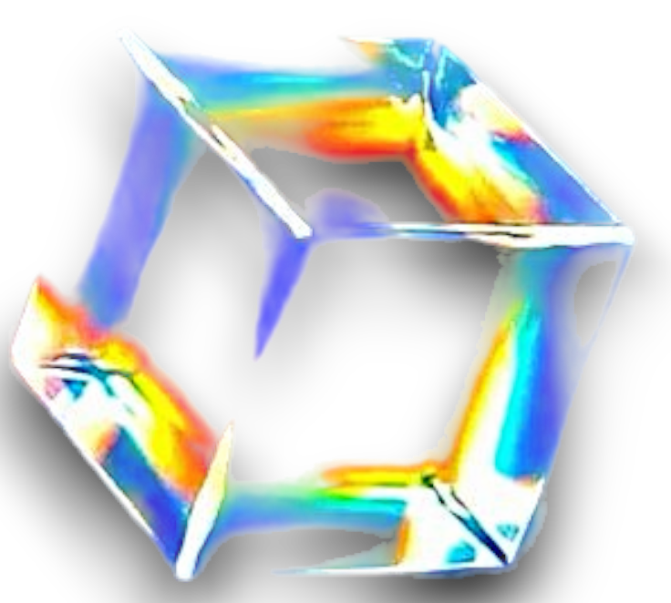
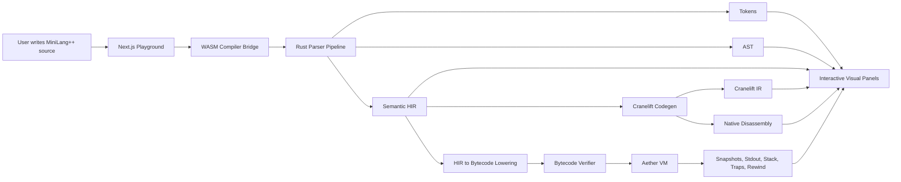
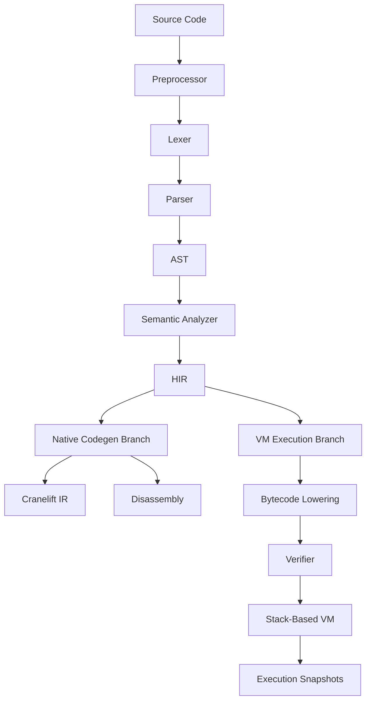
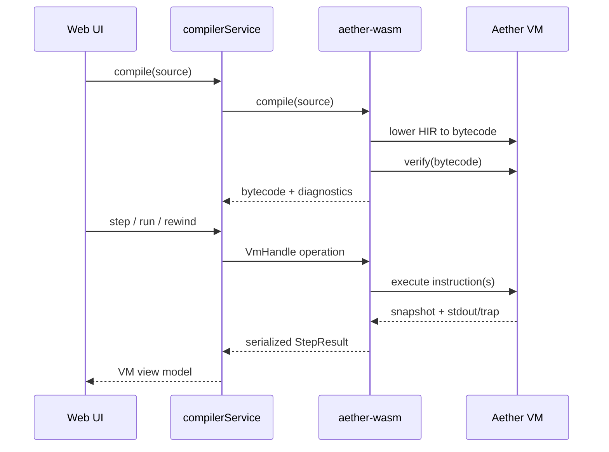
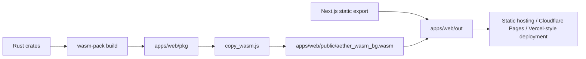

# Aether Project Report

<p align="center">
  
</p>

<h1 align="center">Aether</h1>

<p align="center">
  <strong>See the invisible. Understand the machine.</strong>
</p>

<p align="center">
  A browser-native compiler laboratory for MiniLang++, built with Rust, WebAssembly, Next.js, and a custom virtual machine.
</p>

---

## Submission Overview

| Field | Description |
|---|---|
| Project Name | Aether |
| Prepared By | Ahmad Hassan |
| Report Date | July 20, 2026 |
| Project Type | Compiler visualizer, execution playground, and VM debugger |
| Primary Domain | Compiler construction, systems programming, program analysis, educational tooling |
| Core Technologies | Rust, WebAssembly, Cranelift, TypeScript, Next.js, React, Zustand, Monaco Editor |
| Main User Interface | Static browser application with interactive compiler and VM views |
| Main Backend Model | No traditional server; compilation runs locally in the browser through WebAssembly |
| Repository Style | Monorepo with Rust workspace and web application workspace |

## Abstract

Aether is a systems-focused compiler visualization platform that brings the hidden stages of compilation into an interactive browser workspace. It combines a Rust-based MiniLang++ compiler, a WebAssembly bridge, a custom stack-based virtual machine, and a modern React interface to help users understand how source code becomes executable behavior. The project is designed for compiler education and technical demonstration: it provides authentic compiler artifacts while keeping interaction immediate, visual, and accessible.

## Executive Summary

Aether is a full-stack systems project that turns a compiler pipeline into an interactive, browser-based laboratory. Instead of treating compiler output as a sequence of disconnected terminal dumps, Aether exposes the complete transformation from source code to executable behavior: preprocessing, lexical analysis, parsing, semantic analysis, HIR, control-flow representation, Cranelift IR, assembly inspection, custom bytecode, and virtual-machine execution.

The project is intentionally designed as a real systems artifact, not a simulated visualizer. Its Rust compiler core owns the language semantics, the WebAssembly bridge exposes structured compiler snapshots to the browser, and the Next.js interface converts those snapshots into a navigable workspace. Users can compile MiniLang++ source code, inspect each compiler stage, step through bytecode execution, observe stdout, detect traps, inspect stack and memory state, and rewind execution through VM snapshots.

The strongest idea behind Aether is simple: make invisible compiler behavior visible without reducing it to a toy. The project demonstrates compiler engineering, runtime design, frontend architecture, WebAssembly integration, static deployment, and user-centered technical visualization in one coherent system.

## 1. What Aether Is

Aether is a browser-native compiler laboratory for MiniLang++, a C-like language subset. It allows a user to write or select a program, compile it inside the browser, and inspect the intermediate artifacts that normally remain hidden inside compiler internals.

At a high level, Aether provides:

- A source-code editor for MiniLang++ programs.
- A real Rust compiler pipeline compiled to WebAssembly.
- Token, AST, semantic HIR, CFG, IR, assembly, and bytecode inspection.
- A custom stack-based VM for interactive execution.
- A debugger interface with stepping, rewind, stdout, traps, stack, call stack, and memory views.
- Shareable source examples through permalink encoding.
- Static deployment without a server-side compilation service.

## 2. What, Why, and How

| Question | Answer |
|---|---|
| What is Aether? | Aether is an interactive compiler laboratory where users write MiniLang++ code and inspect the complete path from source text to runtime VM state. |
| Why was it built? | It was built to solve the visibility problem in compiler education: the most important transformations usually happen inside tools that students cannot easily inspect. |
| How does it work? | A Rust compiler core is compiled to WebAssembly, called from a Next.js frontend, and its structured artifacts are rendered as editor-linked views, graphs, IR panels, bytecode, and VM debugger snapshots. |

## 3. Why This Project Matters

Compiler construction is often difficult to learn because most internal states are invisible. Students usually see source code at the beginning and a binary, result, or error at the end. The intellectually interesting part in the middle is commonly hidden behind command-line flags, compiler dumps, and abstract diagrams.

Aether addresses that gap by making the compiler pipeline explorable.

The project matters for three main reasons:

| Reason | Explanation |
|---|---|
| Educational clarity | Aether makes each compiler phase visible and connected to source spans, allowing students to understand how high-level code becomes structured compiler data. |
| Systems authenticity | The compiler, VM, bytecode, verifier, and WebAssembly boundary are implemented as real components instead of static mockups. |
| Practical accessibility | The entire experience runs in the browser, so a user can study compilation and execution without installing a native toolchain. |

The result is both an academic learning tool and a portfolio-grade systems project.

## 4. Core Problem Statement

Traditional compiler learning tools have three limitations:

1. They often show only one stage of the pipeline, such as tokens or AST.
2. They usually disconnect compile-time artifacts from runtime behavior.
3. They frequently require local setup, command-line tooling, or external servers.

Aether solves these problems by creating a single integrated environment where source code, compiler transformations, generated representations, and execution state are available in one interface.

## 5. Project Goals

The project was designed around the following goals:

| Goal | Design Response |
|---|---|
| Make compiler stages visible | Expose tokens, AST, HIR, CFG, IR, assembly, diagnostics, and bytecode as structured artifacts. |
| Preserve real compiler semantics | Keep parsing, semantic analysis, lowering, code generation, and VM execution in Rust. |
| Run anywhere | Compile the Rust core to WebAssembly and deploy the UI as a static site. |
| Support interactive debugging | Use a custom VM with snapshots, stepping, rewind, stdout, stack, call stack, memory, and traps. |
| Keep the UI understandable | Present compiler internals through graphs, panels, tabs, source highlighting, and stage navigation. |
| Remain extensible | Separate parser, codegen, VM, CLI, WASM, and web modules into clear packages. |

## 6. High-Level Architecture



Aether is split into two major systems:

- The compiler/runtime system, written in Rust.
- The interactive visualization system, written in TypeScript and React.

The bridge between them is WebAssembly. This design keeps the compiler trustworthy and portable while allowing the frontend to focus on user experience, visualization, state management, and interaction.

## 7. Repository Architecture

```text
Aether/
  apps/
    web/
      src/app/                  Next.js routes, global styles, visual assets
      src/components/           Playground, visualizers, debugger panels
      src/lib/wasm/compiler.ts  Frontend service boundary around WASM
      src/stores/               Zustand state store
      src/types/                Compiler and VM view models
      src/utils/                Examples, graph layout, permalink helpers

  packages/
    core/
      aether-parser/            Preprocessor, lexer, parser, semantic analysis
      aether-codegen/           Cranelift IR and native code inspection
      aether-vm/                Bytecode ISA, verifier, interpreter, snapshots
      aether-wasm/              WebAssembly bridge for browser execution
      aether-cli/               Native command-line pipeline tool
      tests/                    Compiler and runtime validation tests

  context.md                    Technical handoff and system notes
  KNOWN_LIMITATIONS.md          Documented implementation limits
  README.md                     Project overview and setup instructions
```

This layout separates responsibilities clearly. The Rust crates model the compiler as a set of composable systems, while the web app consumes structured compiler artifacts through a single frontend service facade.

## 8. Compiler Pipeline Design

The compiler pipeline is built in phases so that each stage can be inspected independently:



### 8.1 Preprocessing and Lexing

The parser crate handles preprocessing and lexical analysis. This includes tokenization, macro-related behavior, include handling, warnings, and source locations. Tokens are returned with spans so the frontend can connect token views back to the original source code.

### 8.2 Parsing

The parser turns token streams into AST declarations. The AST captures syntactic structure: functions, declarations, statements, expressions, control flow, and type-level constructs.

### 8.3 Semantic Analysis

Semantic analysis checks whether the parsed program is meaningful. This stage resolves declarations, validates types, builds semantic HIR, and produces warnings or errors. HIR becomes the core representation used by both execution branches.

### 8.4 Native Codegen Branch

The native branch uses Cranelift to generate CLIF IR and native-oriented disassembly. This gives students and evaluators insight into how semantic program structure becomes low-level compiler IR and machine-level representation.

### 8.5 VM Execution Branch

The VM branch lowers HIR into custom bytecode. That bytecode is verified and then executed by Aether's stack-based interpreter. This branch exists because native execution is not ideal for interactive browser debugging. A VM can expose stack state, instruction pointer, traps, stdout, and rewindable snapshots in a controlled way.

## 9. Custom Virtual Machine

The Aether VM is one of the central technical achievements of the project. It is a stack-based execution engine designed for portability, debuggability, and educational transparency.

### VM Responsibilities

| Component | Responsibility |
|---|---|
| Instruction Set | Defines stack operations, arithmetic, comparisons, control flow, calls, memory behavior, and traps. |
| Program Model | Stores instructions, constants, functions, globals, and source-location metadata. |
| Lowering Pass | Converts semantic HIR into VM bytecode. |
| Verifier | Checks bytecode structure before execution. |
| Interpreter | Executes bytecode instruction by instruction. |
| Snapshot System | Captures VM state for stepping and rewind. |
| Trap Model | Represents runtime faults such as division by zero, null dereference, integer overflow, unreachable code, and instruction limits. |

### VM Data Flow



The VM design is especially suitable for a compiler visualizer because it makes runtime behavior inspectable. A normal compiled binary hides stack operations and control flow inside machine execution. Aether's VM exposes these details in a form that can be rendered directly in the browser.

## 10. WebAssembly Boundary

The WebAssembly crate exposes compiler and VM functionality to JavaScript through `wasm_bindgen`. This boundary is intentionally structured around snapshots rather than raw internal compiler objects.

Important exported concepts include:

- `compile(source)`: returns tokens, AST snapshots, HIR snapshots, CLIF IR, VM bytecode, and diagnostics.
- `disassemble(source, target)`: returns disassembly text for a selected target.
- `VmHandle`: creates a VM instance and supports `step`, `run`, `rewind`, and `run_to_cursor`.

This design has two benefits:

1. The frontend receives stable data structures that are safe to render.
2. Rust internals remain free to evolve without forcing every UI component to understand compiler memory layouts.

## 11. Frontend System Design

The frontend is a Next.js 14 application using React, TypeScript, Tailwind CSS, Zustand, Monaco Editor, React Flow, and D3 hierarchy.

### Main UI Responsibilities

| Frontend Area | Purpose |
|---|---|
| Source Editor | Allows editing MiniLang++ code with a familiar programming interface. |
| Pipeline Visualizer | Shows compilation stages and their current status. |
| Token Viewer | Displays lexical output with source spans. |
| AST and HIR Viewers | Render tree/graph structures for syntax and semantic representations. |
| CFG Viewer | Shows control-flow structure for branching and loop behavior. |
| IR/Assembly View | Presents low-level compiler output for inspection. |
| VM Debugger | Provides stepping, rewind, stdout, traps, stack, call stack, memory, and timeline views. |
| Store Layer | Coordinates source, artifacts, selected stage, highlighted span, VM state, latency, and errors. |

### Frontend State Model

The application uses a central compiler store. The store tracks:

- Current source program.
- Current compiler artifacts.
- Selected compiler stage.
- Highlighted source span.
- Current VM snapshot.
- VM timeline and cursor.
- Console output.
- Compilation status and latency.
- Error state.

This state model is important because Aether is not just rendering static data. It is coordinating many linked views: editor selections, graph selections, bytecode rows, VM snapshots, stdout, diagnostics, and stage transitions.

## 12. Design Philosophy

Aether uses two different visual modes:

| Surface | Design Intent |
|---|---|
| Landing Page | Expressive, memorable, and brand-like; introduces Aether as a polished systems project. |
| Playground | Dense, calm, and engineering-focused; prioritizes inspection, comparison, and repeated technical workflows. |

This distinction is important. The landing page creates first impression and identity, while the playground behaves like a serious engineering instrument. The project avoids making the core compiler interface feel like a marketing page. Instead, the workspace is organized around panels, tabs, graphs, source highlighting, and runtime controls.

## 13. What Makes Aether Impressive

Aether stands out because it combines several difficult areas into one coherent system:

| Area | Achievement |
|---|---|
| Compiler Engineering | Implements a real pipeline from preprocessing through semantic HIR and code generation. |
| Runtime Systems | Includes a custom stack-based VM with bytecode, verification, traps, stdout, and snapshots. |
| Browser Systems | Runs the Rust compiler and VM through WebAssembly without a server compiler. |
| Visualization | Converts internal compiler states into interactive panels, trees, graphs, and debugger views. |
| Architecture | Maintains clean boundaries between parser, codegen, VM, WASM, CLI, and frontend. |
| User Experience | Makes advanced systems concepts understandable through direct interaction. |

The project is impressive not because it has one flashy feature, but because the architecture is coherent from compiler core to visual interface.

## 14. Key Engineering Decisions

### 14.1 Rust for Compiler and Runtime

Rust is well suited for this project because compiler and VM code benefit from strong typing, memory safety, explicit data structures, and predictable performance. It also compiles cleanly to WebAssembly, allowing the same core logic to run in the browser.

### 14.2 WebAssembly Instead of a Server Compiler

A traditional architecture would send source code to a backend service for compilation. Aether avoids that dependency. The browser loads the compiler as WebAssembly and executes locally. This improves portability, reduces server complexity, and makes the project easier to deploy as a static application.

### 14.3 Snapshot-Based Communication

The WASM boundary returns snapshots of compiler and VM state. This prevents the frontend from depending too deeply on Rust internals and gives the UI stable presentation models.

### 14.4 Dual Execution/Inspection Backends

Aether uses a native codegen branch for IR and assembly inspection and a VM branch for interactive execution. This is a strong design decision because each branch is optimized for a different purpose:

- Cranelift/native path: good for seeing realistic compiler output.
- VM path: good for deterministic stepping, traps, stdout, stack inspection, and rewind.

### 14.5 Centralized Frontend Service Facade

The frontend accesses WASM through `apps/web/src/lib/wasm/compiler.ts`. Components should use this service rather than directly calling generated WASM exports. This keeps the UI maintainable and makes fallback behavior easier to manage.

## 15. Quality and Verification

Aether includes several layers of validation:

| Validation Layer | Evidence |
|---|---|
| Rust workspace tests | Parser, codegen, VM, CLI, and compiler tests exist under `packages/core`. |
| VM unit tests | Validate instruction behavior, constant pool behavior, jump validation, trap display, and structural correctness. |
| Runner tests | Many `.c` programs validate language features and expected execution behavior. |
| Fuzzing support | Fuzz targets exist for garbage input and parser robustness. |
| WASM verification | The repository includes a WASM comparison verification script. |
| Frontend type safety | TypeScript strict mode and type-check scripts are configured. |
| Frontend lint/build scripts | The web workspace includes lint, type-check, and build commands. |
| Deployment checks | Static build flow copies the generated WASM binary and serves it with correct headers. |

The repository also includes a detailed audit report in `reference/AUDIT_REPORT.md`, which documents build/test status, crate inventory, and known quality concerns. This shows that the project has been evaluated beyond surface-level functionality.

## 16. Deployment Model

Aether is designed for static deployment:



The key advantage is that Aether does not need an always-running backend server. Once built, it can be hosted as static assets. The browser downloads the UI and WASM bundle, then runs compilation locally.

## 17. Current Limitations

The project is honest about current limitations, which is important for a systems submission.

Known limitations include:

- VM lowering does not fully support unions.
- Variadic functions are limited in the VM branch.
- Struct parameters and struct returns by value are not fully supported in VM execution.
- External declarations without function bodies can cause issues in VM execution.
- Some floating-point initializer and cast cases are restricted.
- Cranelift calling conventions can differ by target platform.
- The native/JIT branch and VM branch intentionally serve different purposes and are not exact replacements for each other.

These limitations do not weaken the project. Instead, they show a realistic engineering boundary: Aether has a defined scope, documents what it supports, and separates future work from completed behavior.

## 18. Security, Safety, and Reliability Considerations

Aether's architecture has several safety advantages:

- Source code is compiled locally in the browser, reducing the need to send user programs to a remote server.
- The VM executes custom bytecode rather than arbitrary native code in the browser.
- Runtime traps are represented explicitly instead of being hidden crashes.
- The verifier checks bytecode structure before VM execution.
- WebAssembly provides a sandboxed execution model for the Rust compiler core.
- Static hosting reduces backend attack surface.

## 19. Future Enhancements

Potential future improvements include:

- Broader C subset support in the VM backend.
- Stronger parity between VM bytecode execution and native codegen behavior.
- Richer graph layouts for complex control-flow programs.
- More precise source-to-IR and source-to-bytecode mapping.
- Exportable reports for a compiled program.
- Classroom mode with guided explanations for each compiler stage.
- Additional test dashboards and visual regression tests for the playground.
- Language-server-style diagnostics and hover explanations.

## 20. Conclusion

Aether is a strong systems project because it connects theory, implementation, and interaction. It does not merely explain compilers; it lets users observe one working. The project combines a Rust compiler pipeline, a WebAssembly delivery model, a custom virtual machine, bytecode verification, interactive debugging, graph-based visualization, and a polished web interface.

The result is a project that is technically deep, educationally useful, and professionally presented. Aether demonstrates not only how a compiler transforms code, but also how thoughtful system design can make complex internal processes understandable.

In short, Aether is a static website that behaves like a compact compiler IDE and VM debugger. It makes the machine visible.

---

## Appendix A: Technology Stack

| Layer | Tools |
|---|---|
| Compiler Core | Rust |
| Parser/Semantics | `aether-parser` |
| Code Generation | Cranelift |
| Virtual Machine | `aether-vm` |
| Browser Bridge | `wasm-bindgen`, `serde_wasm_bindgen` |
| Web Framework | Next.js 14 |
| UI Runtime | React 18 |
| Language | TypeScript |
| Styling | Tailwind CSS |
| State Management | Zustand |
| Editor | Monaco Editor |
| Graphs | React Flow, D3 hierarchy |
| Animation | Framer Motion, GSAP |
| Build Orchestration | pnpm, Turbo, Cargo, wasm-pack |

## Appendix B: Important Commands

```bash
pnpm install
pnpm wasm:build
pnpm dev
pnpm build
pnpm typecheck
pnpm core:test
```

## Appendix C: Main Code References

| File | Purpose |
|---|---|
| `packages/core/aether-parser/` | Preprocessor, lexer, parser, semantic analysis, AST/HIR data |
| `packages/core/aether-codegen/` | Cranelift IR and native code generation path |
| `packages/core/aether-vm/src/isa.rs` | VM instruction set architecture |
| `packages/core/aether-vm/src/lower.rs` | HIR to bytecode lowering |
| `packages/core/aether-vm/src/verifier.rs` | Bytecode validation |
| `packages/core/aether-vm/src/interp.rs` | VM interpreter |
| `packages/core/aether-vm/src/snapshot.rs` | VM snapshot model |
| `packages/core/aether-wasm/src/lib.rs` | WASM exports and VM handle |
| `apps/web/src/lib/wasm/compiler.ts` | Frontend compiler service facade |
| `apps/web/src/stores/compilerStore.ts` | Main frontend state store |
| `apps/web/src/components/` | Visualizer and debugger UI components |
