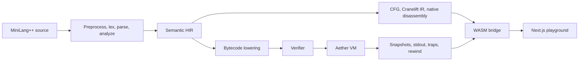

<p align="center">
  
</p>

<h1 align="center">Aether</h1>

<p align="center">
  See the invisible. Understand the machine.
</p>

<p align="center">
  <a href="https://aether.vercel.app/playground">Live demo</a>
  ·
  <a href="context.md">Project context</a>
  ·
  <a href="KNOWN_LIMITATIONS.md">Known limitations</a>
</p>

<p align="center">
  
  
  
  
  
</p>

## Overview

Aether is a browser native compiler laboratory for MiniLang++, a C subset compiler written in Rust.

It runs the compiler through WebAssembly in the browser, then exposes the full path from source code to runtime state. Users can inspect tokens, AST, semantic HIR, CFG, Cranelift IR, native disassembly, bytecode, and a custom VM debugger with stepping, rewind, stdout, traps, stack, call stack, and memory views.

The project is designed as a real systems artifact rather than a mock visualizer. The compiler core owns language semantics. The web app presents the artifacts, connects them through source spans, and makes each phase navigable.

## Why Aether Exists

Compilers are usually taught as disconnected dumps: tokens in one view, AST in another, IR in a terminal, and runtime behavior somewhere else. Aether connects those pieces into one interactive workspace.

The result is useful for compiler education, systems portfolios, language tooling experiments, and anyone who wants to understand how source code becomes executable behavior.

## Highlights

<table>
  <tr>
    <td><strong>Real compiler pipeline</strong></td>
    <td>Preprocessing, lexer, parser, semantic analysis, HIR, CFG, Cranelift IR, native disassembly, bytecode, and VM execution.</td>
  </tr>
  <tr>
    <td><strong>Browser only execution</strong></td>
    <td>The compiler and VM run through WebAssembly. No application server is required for compilation or debugging.</td>
  </tr>
  <tr>
    <td><strong>Interactive graphs</strong></td>
    <td>AST and Semantic HIR use readable tree layouts. CFG uses a flow layout with branch structure.</td>
  </tr>
  <tr>
    <td><strong>IR and assembly translation view</strong></td>
    <td>Semantic HIR, Cranelift IR, and native assembly are shown side by side with click to pin matching rows.</td>
  </tr>
  <tr>
    <td><strong>Rewindable VM debugger</strong></td>
    <td>Step, run, rewind, inspect bytecode, stack, call stack, memory, stdout, traps, and current source span.</td>
  </tr>
  <tr>
    <td><strong>Shareable source</strong></td>
    <td>The current source can be encoded into the URL for reproducible examples and demos.</td>
  </tr>
</table>

## Product Surfaces

<table>
  <tr>
    <th>Route</th>
    <th>Purpose</th>
  </tr>
  <tr>
    <td><code>/</code></td>
    <td>Visual landing page with shader background, logo, and animated entry button.</td>
  </tr>
  <tr>
    <td><code>/playground</code></td>
    <td>The full compiler playground and VM debugger.</td>
  </tr>
</table>

## Architecture



## Repository Layout

```text
Aether/
  apps/
    web/                         Next.js app, landing page, playground
      src/app/                   routes, global styles, fonts, logo assets
      src/components/            React components
      src/components/ui/         shadcn style reusable UI components
      src/lib/wasm/compiler.ts   frontend compiler service facade
      src/stores/                Zustand playground state
      src/types/                 compiler view models
      src/utils/                 examples, permalinks, graph helpers

  packages/
    core/
      aether-parser/             preprocessor, lexer, parser, semantic analysis
      aether-codegen/            Cranelift lowering and native code inspection
      aether-vm/                 bytecode, verifier, interpreter, snapshots
      aether-wasm/               wasm bridge consumed by the web app
      aether-cli/                native command line interface
      tests/                     compiler and runtime tests

  context.md                     deep engineering handoff
  vercel.json                    static deployment and wasm headers
```

## Compiler Pipeline

```text
Source
  to Preprocessor
  to Lexer
  to Parser
  to Semantic HIR
  to Native branch
       CFG
       Cranelift IR
       Native disassembly
  to VM branch
       Bytecode lowering
       Verifier
       VM interpreter
       Snapshots and rewind
```

## Web Stack

<table>
  <tr><td>Framework</td><td>Next.js 14 App Router</td></tr>
  <tr><td>UI</td><td>React 18, Tailwind CSS, local Geist fonts</td></tr>
  <tr><td>Language</td><td>TypeScript strict mode</td></tr>
  <tr><td>State</td><td>Zustand</td></tr>
  <tr><td>Editor</td><td>Monaco Editor</td></tr>
  <tr><td>Graphs</td><td>React Flow and D3 hierarchy</td></tr>
  <tr><td>Motion</td><td>Framer Motion, GSAP for landing decoration</td></tr>
  <tr><td>Compiler runtime</td><td>Rust compiled to WebAssembly</td></tr>
  <tr><td>Deployment</td><td>Static export on Vercel</td></tr>
</table>

## Getting Started

Requirements:

```text
Node.js 20 or newer
pnpm 9 or newer
Rust toolchain
wasm-pack
```

Install dependencies:

```bash
pnpm install
```

Build the WebAssembly package:

```bash
pnpm wasm:build
```

Start development:

```bash
pnpm dev
```

Open:

```text
http://localhost:3000/playground
```

If another port is already in use, Next.js may choose the next available port.

## Common Commands

<table>
  <tr>
    <th>Command</th>
    <th>Purpose</th>
  </tr>
  <tr>
    <td><code>pnpm dev</code></td>
    <td>Run all development tasks through Turbo.</td>
  </tr>
  <tr>
    <td><code>pnpm build</code></td>
    <td>Build the workspace.</td>
  </tr>
  <tr>
    <td><code>pnpm wasm:build</code></td>
    <td>Compile the Rust WASM package into <code>apps/web/pkg</code>.</td>
  </tr>
  <tr>
    <td><code>pnpm wasm:verify</code></td>
    <td>Run WASM comparison verification.</td>
  </tr>
  <tr>
    <td><code>pnpm core:test</code></td>
    <td>Run Rust workspace tests.</td>
  </tr>
  <tr>
    <td><code>pnpm typecheck</code></td>
    <td>Run TypeScript checks through Turbo.</td>
  </tr>
  <tr>
    <td><code>pnpm vercel-build</code></td>
    <td>Build WASM first, then build the static web app for deployment.</td>
  </tr>
</table>

Web only:

```bash
cd apps/web
npm run dev
npm run build
npm run type-check
```

## Deployment

The web app is statically exported by Next.js. Vercel should use:

```bash
pnpm vercel-build
```

The exported app is written to:

```text
apps/web/out
```

The WASM binary is served at:

```text
/aether_wasm_bg.wasm
```

`vercel.json` sets the correct `application/wasm` content type and long lived cache headers.

## Design Notes

Aether has two visual modes.

The landing page is expressive: WebGL shader background, logo, animated gradient button, and a subtle outlined signature.

The playground is an engineering instrument: dense, quiet, dark, source connected, and organized around real compiler state. Motion in the playground should represent compilation, graph flow, selection, or VM timeline changes.

## Documentation

For a deeper technical handoff, read:

```text
context.md
```

That file covers the architecture, data flow, active components, graph systems, VM debugger, WASM boundary, deployment model, and guardrails for future work.

## License

See `LICENSE.txt`.
