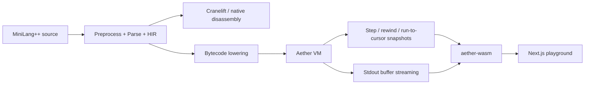

# Aether

> See the invisible. Understand the machine.

Aether is a browser-native compiler visualizer for MiniLang++ (a C subset). It runs the full pipeline in WebAssembly, then exposes tokens, AST, HIR, Cranelift IR, native disassembly, and a custom bytecode VM with single-step, rewind, trap inspection, and console streaming.

Live demo: https://aether.vercel.app/playground

## What lives where

```text
Aether/
├── packages/core/            Rust compiler and VM workspace
│   ├── aether-parser/        lexer, preprocessor, parser, semantic analysis
│   ├── aether-codegen/       Cranelift IR and native code generation
│   ├── aether-vm/            bytecode lowering, interpreter, rewindable history
│   └── aether-wasm/          wasm-bindgen bridge into the browser
├── apps/web/                 Next.js static export for the landing page + playground
└── vercel.json               Vercel build config and wasm content-type header
```

## Runtime architecture



The UI is split into two browser routes:

- `/` is the landing page.
- `/playground` is the interactive compiler lab.

## Highlights

- Real compiler phases, not mock panels.
- Shareable permalinks that encode the current source in the URL.
- Curated examples so first-time visitors never open an empty editor.
- Keyboard-first execution: `Ctrl/Cmd+Enter` compiles and `Space` steps the VM.
- Structured traps with source spans and payload fields such as `index` and `length`.

## Why this design

Aether keeps the compiler core and the browser UI deliberately separate. The Rust workspace owns compilation and execution semantics, while the web app is responsible for presentation, persistence, and interaction. That split matters for two reasons:

1. It keeps the compiler logic testable and reusable outside the browser.
2. It makes the UX portable and cheap to deploy because the entire experience ships as a static site plus a single wasm binary.

For a compiler course, this is useful because each phase is visible independently. For research or admissions review, it shows a complete systems story: parsing, lowering, execution, rewindable state, and user-facing diagnostics are all connected end to end.

## Local development

```bash
pnpm install
pnpm wasm:build
pnpm dev
```

## Verification

```bash
pnpm lint
pnpm typecheck
pnpm core:test
pnpm wasm:verify
```

## Deployment

Vercel should use the root build command `pnpm vercel-build`, which runs the wasm build first and then builds the static Next.js app. The exported site lives in `apps/web/out`.

The wasm asset is served from `/aether_wasm_bg.wasm`, and `vercel.json` pins its content type to `application/wasm` so the browser loads it correctly during static hosting.
