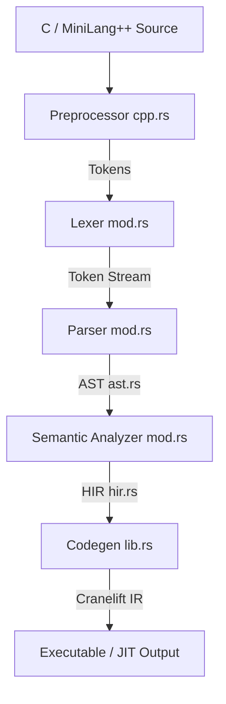

# ◈ Aether — Developer Context & Architectural Onboarding

Welcome to Aether! This document serves as the absolute source of truth for the codebase, architecture, internal compiler design, testing infrastructure, and current monorepo state of Aether. It is written to get any incoming engineer fully oriented and code-ready immediately.

---

## 1. Project Vision & Purpose

Aether is a **live compiler visualization environment** for **MiniLang++** (a subset of C++). It is designed to expose the compiler's internal pipeline (tokens, AST, HIR, and Cranelift IR) in real-time, allowing users to watch code compile token by token, node by node.

### Core Goals
- **Real-Time Visual Feedback**: Parse source code and stream structural data of compilation phases to a modern web application.
- **Educational Architecture**: Showcase compiler construction concepts visually.
- **Robust Compilation**: Forked from Jynn Nelson's `saltwater` compiler core (written in Rust), utilizing **Cranelift** as the backend.
- **Academic Context**: Built for **CS3045 Compiler Construction · Spring 2026** at the University of Management and Technology, Lahore, Pakistan.

---

## 2. Macro Architecture & Monorepo State

Aether is structured as a monorepo managed via **pnpm** and **Turborepo** on the JavaScript side, alongside a **Rust Workspace**.

### Directory Structure Overview
```
Aether/
├── apps/
│   ├── api/                  # Python/FastAPI bridge placeholder (.gitkeep)
│   └── web/                  # Next.js 14 visualizer frontend placeholder (.gitkeep)
├── packages/
│   ├── core/                 # Rust compiler binary workspace placeholder (.gitkeep)
│   ├── types/                # Shared TS type definitions placeholder (.gitkeep)
│   └── ui/                   # Reusable frontend UI components placeholder (.gitkeep)
├── saltwater-parser/         # Main parser, lexer, preprocessor, & semantic analyzer (Rust)
├── saltwater-codegen/        # Cranelift code generator (Rust)
├── src/                      # Main CLI driver entry point (main.rs)
├── tests/                    # Integration and regression test suite
├── benches/                  # Criterion parser benchmarks
├── fuzz/                     # Cargo-fuzz targets
├── minimizer/                # Test-case minimization script
├── docker/                   # Docker environment templates (.gitkeep)
├── Cargo.toml                # Rust workspace configuration
├── package.json              # Monorepo task configurations
├── pnpm-workspace.yaml       # pnpm workspace layout
└── turbo.json                # Turborepo build/dev task pipelines
```

### Critical Workspace Inconsistency (Monorepo Transition)
> [!IMPORTANT]
> The repository is in the middle of a transition to a monorepo setup:
> 1. **Code Locations**: The compiler source files (`src/main.rs`), [`saltwater-parser`](file:///c:/Users/ahmad/Desktop/Aether/saltwater-parser), and [`saltwater-codegen`](file:///c:/Users/ahmad/Desktop/Aether/saltwater-codegen) currently live at the **root** level of the project.
> 2. **Rust Workspace**: The root [Cargo.toml](file:///c:/Users/ahmad/Desktop/Aether/Cargo.toml) has been modified to a pure workspace configuration indicating `members = ["packages/core"]`. However, [packages/core](file:///c:/Users/ahmad/Desktop/Aether/packages/core) only contains a placeholder `.gitkeep` and lacks a `Cargo.toml`.
> 3. **Building**: The npm script `"core:build"` in [package.json](file:///c:/Users/ahmad/Desktop/Aether/package.json#L13) references `packages/core/Cargo.toml`. Since this file is currently missing, compilation using monorepo scripts will fail until the compiler source is migrated into `packages/core/` or the workspace members list is updated to reference root-level directories.

---

## 3. Rust Compiler Core: Internals & Compilation Phases

The Aether compiler executes code generation via five primary stages. The logic spans [`saltwater-parser`](file:///c:/Users/ahmad/Desktop/Aether/saltwater-parser) and [`saltwater-codegen`](file:///c:/Users/ahmad/Desktop/Aether/saltwater-codegen).



### Phase 1: Preprocessing & Location Tracking
- **Location DB**: The compiler uses a custom wrapper around `codespan` found in [files.rs](file:///c:/Users/ahmad/Desktop/Aether/saltwater-parser/lex/files.rs) to map spans to filenames, line numbers, and character columns.
- **Preprocessor**: Implemented in [cpp.rs](file:///c:/Users/ahmad/Desktop/Aether/saltwater-parser/lex/cpp.rs), the `PreProcessor` struct processes directives sequentially:
  - `#include` (resolves and parses local or system files using the config search path).
  - `#define` and `#undef` (defines macros, handled by [replace.rs](file:///c:/Users/ahmad/Desktop/Aether/saltwater-parser/lex/replace.rs)).
  - `#if`, `#ifdef`, `#ifndef`, `#else`, `#elif`, and `#endif` (conditional compilation block stack).
  - Line numbers and compiler flags.

### Phase 2: Lexical Analysis
- **Lexer**: The main `Lexer` struct in [mod.rs](file:///c:/Users/ahmad/Desktop/Aether/saltwater-parser/lex/mod.rs) converts preprocessed strings into structured `Token` enum variants defined in [lex.rs](file:///c:/Users/ahmad/Desktop/Aether/saltwater-parser/data/lex.rs) (punctuators, literals, keywords, identifiers).
- **Radix Support**: Parses binary, octal, decimal, and hexadecimal formats (`parse_num` in [mod.rs](file:///c:/Users/ahmad/Desktop/Aether/saltwater-parser/lex/mod.rs#L137)).

### Phase 3: Parsing (AST Construction)
The parser is a recursive-descent parser mapping C/MiniLang++ grammar rules directly into Abstract Syntax Tree (AST) nodes defined in [ast.rs](file:///c:/Users/ahmad/Desktop/Aether/saltwater-parser/data/ast.rs).
- **Declarations**: Handled by [decl.rs](file:///c:/Users/ahmad/Desktop/Aether/saltwater-parser/parse/decl.rs), resolving standard specifiers, pointers, functions, array bounds, struct/union members, and enum variants.
- **Expressions**: Handled by [expr.rs](file:///c:/Users/ahmad/Desktop/Aether/saltwater-parser/parse/expr.rs), using a Pratt-parser / precedence climbing approach to respect standard C operator precedence.
- **Statements**: Handled by [stmt.rs](file:///c:/Users/ahmad/Desktop/Aether/saltwater-parser/parse/stmt.rs) (loops, selection structures, breaks, jumps, labels, switches).
- **Lookahead & Lookaside**: The driver `Parser` ([mod.rs](file:///c:/Users/ahmad/Desktop/Aether/saltwater-parser/parse/mod.rs)) caches up to two lookahead tokens to disambiguate types and variables (e.g., distinguishing function pointers `int (*x)` from calls/casts).

### Phase 4: Semantic Analysis (AST ➔ HIR)
Semantic analysis checks the program structure, enforces typing constraints, and converts AST structs into High Intermediate Representation (HIR) nodes ([hir.rs](file:///c:/Users/ahmad/Desktop/Aether/saltwater-parser/data/hir.rs)).
- **Driver**: The `Analyzer` and `PureAnalyzer` structs in [mod.rs](file:///c:/Users/ahmad/Desktop/Aether/saltwater-parser/analyze/mod.rs) track 4 distinct namespaces/scopes: identifiers (ordinary variables/typedefs), tags (struct/union/enum definitions), labels, and structure members.
- **Initializers**: Type checked and validated for structure/scalar targets in [init.rs](file:///c:/Users/ahmad/Desktop/Aether/saltwater-parser/analyze/init.rs).
- **Expressions & Casts**: Type matching, implicit casting, decay of array types to pointer types, pointer dereferencing, and mathematical operations are validated in [expr.rs](file:///c:/Users/ahmad/Desktop/Aether/saltwater-parser/analyze/expr.rs).
- **Statements**: Loops, `switch` case coverage, labels, and function return values are checked for correctness in [stmt.rs](file:///c:/Users/ahmad/Desktop/Aether/saltwater-parser/analyze/stmt.rs).

### Phase 5: Code Generation
Aether uses **Cranelift** (v0.66) to generate native object files, assemblies, or invoke Just-in-Time (JIT) execution.
- **Target ISA**: Configured via `get_isa` in [lib.rs](file:///c:/Users/ahmad/Desktop/Aether/saltwater-codegen/lib.rs#L45). It enables PIC (Position Independent Code) for normal compilation or disables it for JIT usage.
- **Stack Allocation**: Parameters, locals, and structs are stored as explicit Cranelift stack slots ([lib.rs](file:///c:/Users/ahmad/Desktop/Aether/saltwater-codegen/lib.rs#L151)).
- **Expressions Compilation**: Translates HIR expressions into Cranelift basic blocks and instructions in [expr.rs](file:///c:/Users/ahmad/Desktop/Aether/saltwater-codegen/expr.rs).
- **Control Flow**: Translates loops, conditional jumps, labels, switches (using `cranelift::frontend::Switch`), and exits to low-level assembly blocks in [stmt.rs](file:///c:/Users/ahmad/Desktop/Aether/saltwater-codegen/stmt.rs).
- **Static Globals**: Handles zeroed or explicitly initialized global constants and values in [static_init.rs](file:///c:/Users/ahmad/Desktop/Aether/saltwater-codegen/static_init.rs).

---

## 4. Key Compiler Quirks & Decisions

Aether retains structural behavior from its saltwater roots:
1. **Recursion Limit**: To prevent segment faults during deep parsing (e.g., highly nested brace expressions), `RecursionGuard` enforces a limit of 1,000 recursive depths in debug builds and 10,000 in release builds, terminating with exit code `102` ([lib.rs](file:///c:/Users/ahmad/Desktop/Aether/saltwater-parser/lib.rs#L119)).
2. **Right-Shift Behavior**: On negative integers, right-shift performs an arithmetic shift (keeping the sign bit), which behaves as division by two rounding towards negative infinity ([IMPLEMENTATION_DEFINED.md](file:///c:/Users/ahmad/Desktop/Aether/IMPLEMENTATION_DEFINED.md#L11)).
3. **Ignored Keywords**: `inline` and `register` keywords are parsed but completely ignored ([IMPLEMENTATION_DEFINED.md](file:///c:/Users/ahmad/Desktop/Aether/IMPLEMENTATION_DEFINED.md#L18-L26)).
4. **Salty Flavor**: If compiled with the `"salty"` feature, the compiler installs a custom panic hook that plays an R2D2 scream audio file and prints randomized insult messages to the developer.

---

## 5. Testing Framework

Testing in Aether is organized into multiple test suites under [tests/](file:///c:/Users/ahmad/Desktop/Aether/tests):

### A. Integration test runner (`tests/runner.rs`)
Iterates over all files recursively inside `tests/runner-tests/`. It reads the first line comment in each `.c` file to determine the test assertion type:
- `// compile` — Asserts that compilation finishes.
- `// no-main` — Compiles without requiring a `main` function definition.
- `// fail` | `// compile-fail` | `// compile-error` — Asserts that compilation fails with semantic or lexical errors.
- `// succeeds` — Compiles, links, runs, and asserts that the process exits with `0`.
- `// crash` — Asserts compiling succeeds but crashes during execution.
- `// code: <number>` — Asserts compiling succeeds and exits with code `<number>`.
- `// errors: <number>` — Asserts compilation fails with exactly `<number>` diagnostic errors.
- `// output: <expected>` — Compiles, runs, and asserts that standard output matches `<expected>` (supports multi-line templates using `BEGIN:` and `END` directives).

### B. Variadic function testing (`tests/varargs.rs`)
Verifies compiler output against the host system's `printf` tool. It invokes `printf` on the host, extracts the expected string, compiles the same call in saltwater, runs it, and asserts they produce identical outputs.

### C. Stack overflow testing (`tests/stack-overflow.rs`)
Passes deeply nested structures to `swcc` and asserts that the compiler gracefully aborts with error code `102` without encountering a stack overflow segmentation fault.

---

## 6. Development Utilities

### Crash Minimizer (`minimizer/minimize.sh`)
Located in [minimizer/](file:///c:/Users/ahmad/Desktop/Aether/minimizer), this script automates the reduction of complex C source files that cause the compiler to panic or crash.
- Usage: `./minimize.sh <input_file> <condition_script> <args>`
- It systematically strips lines and expressions, validating against conditions like `return_code_equals` or `output_contains` until it finds the smallest possible file that reproduces the crash.

### C Preprocessor Driver (`mycpp`)
A bash wrapper script ([mycpp](file:///c:/Users/ahmad/Desktop/Aether/mycpp)) that executes the system C preprocessor (`cpp`) with all double and float limit definitions, along with standard architecture macros, to simulate compiler preprocess behavior.

---

## 7. Next Steps for Developers

To start hacking on the visualizer environment:
1. **Unify Workspace Files**: Resolve the monorepo workspace discrepancy by migrating `src/`, `saltwater-parser/`, `saltwater-codegen/`, and the root configuration into `packages/core` to match Turborepo requirements.
2. **Setup Local Environment Variables**:
   - Copy `.env.example` to `.env`.
   - Setup `GROQ_API_KEY` for compiler logic commentary/narration.
3. **Install Dependencies**: Run `pnpm install` in the root.
4. **Compile Core**: Run `pnpm core:build`.
5. **Run Visualization Server**: Start the client visualizer and the fastapi server using `pnpm dev`.
6. **Deploy / Verify**: View the local server at `http://localhost:3000` to interact with the compiler visualizer.
